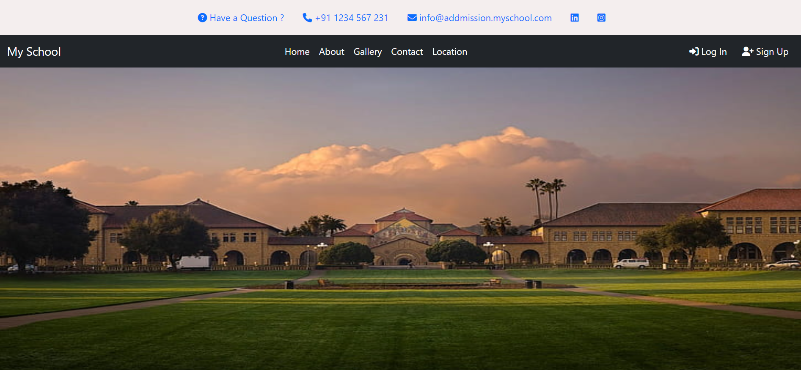

# School-Management-System
Technologies Used: HTML, CSS, JavaScript, Bootstrap, PHP, MySQL ( Sep 2022 – Oct 2022 )
•Description: Developed a School Management System aimed at optimizing administrative processes within a school setting. This comprehensive system incorporated essential features such as user login, registration, account management, and robust search functionalities.

School Management System Project Link : <a href="http://school-management-sid70.infinityfreeapp.com/">Visit My School Management System Project </a>

This is my Project View:

